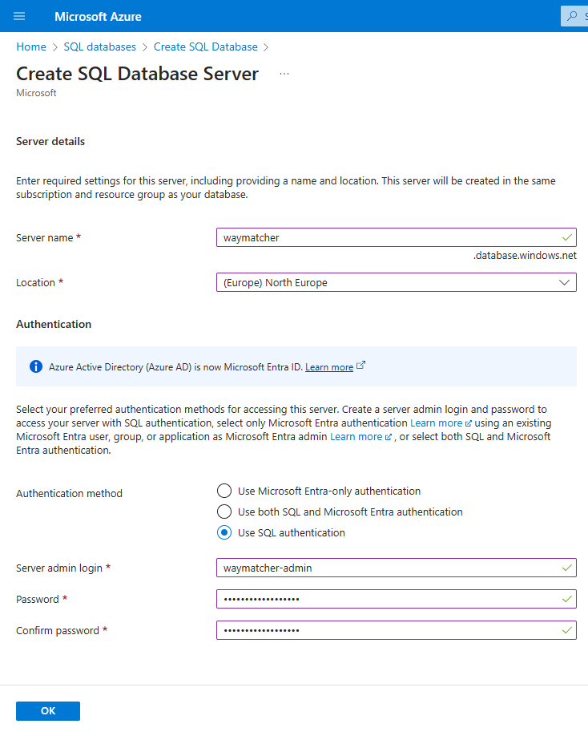
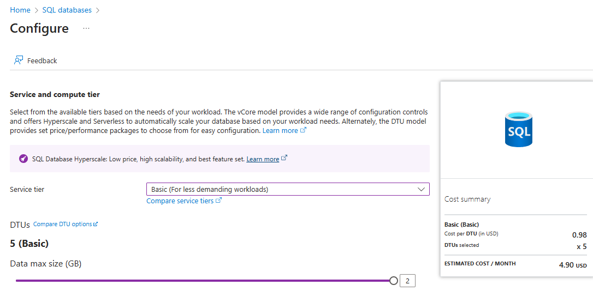
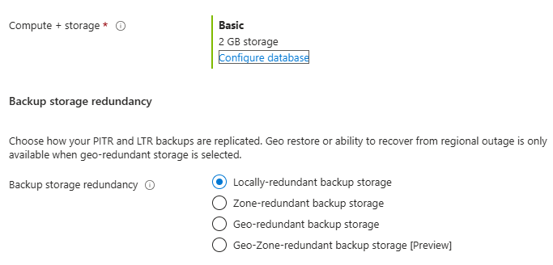
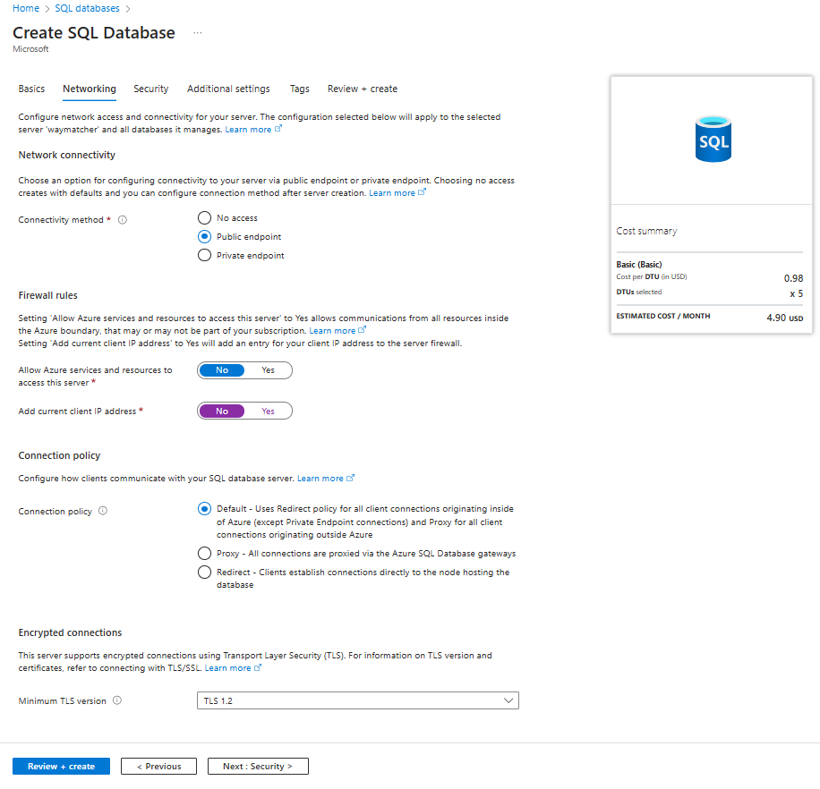
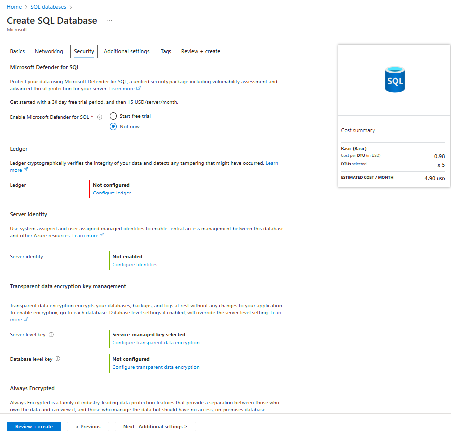
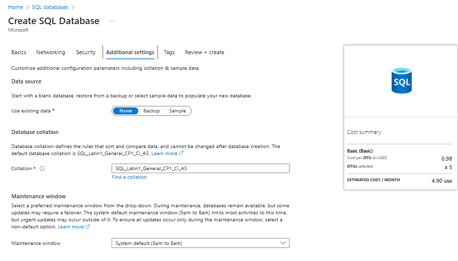
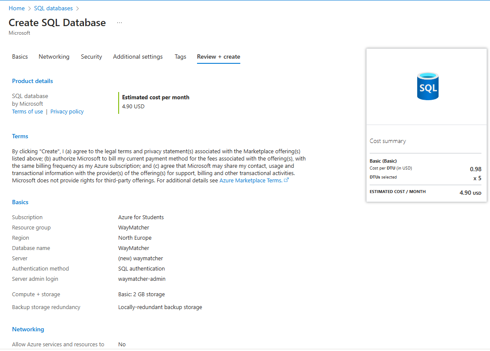
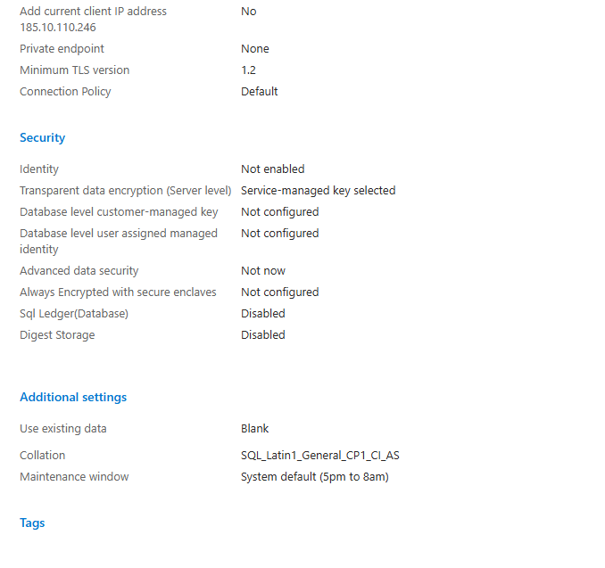
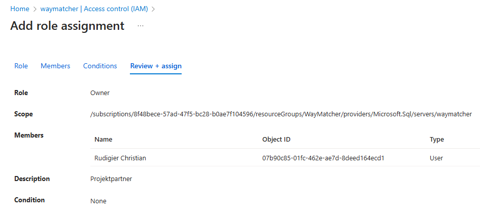

# Azure Database Setup

- [Azure Database Setup](#azure-database-setup)
  - [Create SQL Database Server](#create-sql-database-server)
    - [Server Configuration](#server-configuration)
      - [Server-Config](#server-config)
      - [Other Database Settings](#other-database-settings)
      - [Networking Settings](#networking-settings)
      - [Security Settings](#security-settings)
      - [Additional Settings](#additional-settings)
      - [Summary](#summary)
    - [User Permissions](#user-permissions)

## Create SQL Database Server

### Server Configuration

#### Server-Config

Hier wurde in DTU basierter Server ausgewählt

**Achtung: Server danach löschen!**

#### Other Database Settings

#### Networking Settings

#### Security Settings

#### Additional Settings

#### Summary

### User Permissions

